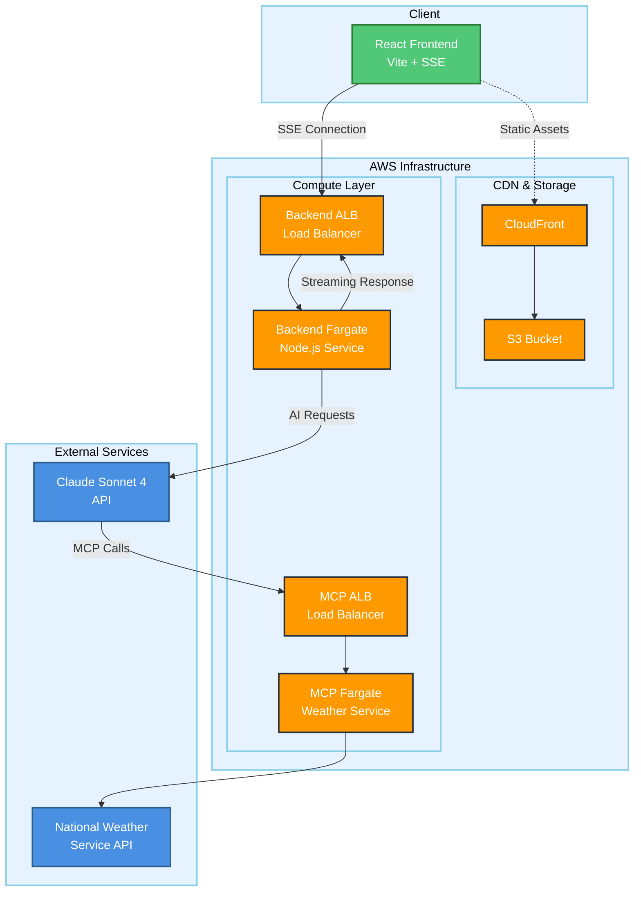

# MCP Chatbot Demo

A demonstration of Model Context Protocol (MCP) architecture demonstarting how to build scalable, streaming AI applications on [cloud infrastructure.

## What is MCP?

[Model Context Protocol](https://modelcontextprotocol.io/introduction) is Anthropic's open standard that enables AI assistants to securely connect to external data sources and tools. This demo shows how to build a production-ready architecture that leverages MCP servers for enhanced AI capabilities.

### MCP Approach Benefits:

- **Reusability**: One MCP server can serve multiple AI applications
- **Dynamic Discovery**: Tools can be added/removed without changing your app
- **Standardization**: Common protocol across different AI providers
- **Isolation**: Tool logic is separate from your application logic
- **Scalability**: MCP servers can be deployed independently

## Architecture Overview

This project demonstrates a clean, scalable approach to building AI applications with real-time streaming responses:

- **Frontend**: Vite-based React application with Server-Sent Events (SSE) for real-time streaming
- **Backend**: Node.js service with choice of AWS App Runner or Fargate deployment
- **MCP Server**: Fastify-based service with choice of AWS App Runner or Fargate deployment
- **Infrastructure**: Single-file AWS CDK for complete infrastructure as code

## Key Architectural Decisions

### Real Streaming with SSE + ALB

Uses Server-Sent Events through Application Load Balancer. This enables true streaming responses for long-running AI operations.

### Container-First Approach

Backend services run in containers providing:

- Scale-to-zero cost optimization
- Consistent deployment environments
- Easy local development with Docker

### Infrastructure as Code

Single CDK file contains all AWS resources, making it easy to:

- Create/destroy complete environments
- Version control infrastructure changes
- Deploy identical environments for dev/test/prod

### Deployment Flexibility

Provides two deployment options for both backend and MCP server:

- **App Runner**: Simpler deployment, 2-minute timeout, cost-optimized
- **Fargate**: Enterprise-grade, configurable timeouts, full load balancer control

## Technology Stack

- **Frontend**: Vite, React, TypeScript
- **Backend**: Node.js, Fastify, Server-Sent Events
- **MCP Server**: Fastify, Node.js
- **Infrastructure**: AWS CDK, Fargate, ALB, CloudFront
- **AI Integration**: Claude Sonnet 4 via Anthropic API
- **External APIs**: National Weather Service API

## Getting Started

### Prerequisites

- Node.js 22+
- AWS CLI installed and configured with credentials
- Docker (for container deployment)
- Anthropic API key

### Local Development

```bash
# Install dependencies
npm install

# Start MCP server
cd mcp-server
npm run dev

# Start backend (in separate terminal)
cd backend
npm run dev

# Start frontend (in separate terminal)
cd frontend
npm run dev
```

### Deployment

**Infrastructure Deployment**

First, ensure AWS CLI is configured with appropriate credentials and permissions, and set required environment variables.

```bash
# Set required environment variable
export ANTHROPIC_API_KEY=your_anthropic_api_key_here

# Install CDK dependencies
npm install

# Bootstrap CDK (first time only per AWS account/region)
npx cdk bootstrap

# Deploy all services
npx cdk deploy --all --context environment=dev

# Deploy to production
export ANTHROPIC_API_KEY=your_production_key
npx cdk deploy --all --context environment=prod

# Destroy environment when no longer needed
npx cdk destroy --all --context environment=dev
```

**Manual Step-by-Step Deployment (Alternative)**

If you prefer to deploy services individually, follow this order due to cross-stack dependencies. See [Deployment Options](#deployment-options) below for choosing between App Runner and Fargate.

```bash
# 1. Deploy MCP server first (exports URL for backend)
npx cdk deploy ChatbotMcpAppRunner-dev --context environment=dev
# OR
npx cdk deploy ChatbotMcpFargate-dev --context environment=dev

# 2. Deploy backend second (imports MCP URL, exports backend URL)
npx cdk deploy ChatbotBackendAppRunner-dev --context environment=dev
# OR
npx cdk deploy ChatbotBackendFargate-dev --context environment=dev

# 3. Deploy frontend last (imports backend URL)
npx cdk deploy ChatbotFrontend-dev --context environment=dev
```

**Deployment Options**

Both the backend and MCP server offer two deployment options:

- **App Runner** (`ChatbotBackendAppRunner-{env}`, `ChatbotMcpAppRunner-{env}`): Simpler, cheaper, 2-minute timeout
  - Best for: Most business use cases, cost optimization, simple deployment
  - Limitations: 2-minute request timeout, less configuration control

- **Fargate** (`ChatbotBackendFargate-{env}`, `ChatbotMcpFargate-{env}`): More robust, configurable, no timeout limits
  - Best for: Enterprise use cases, long-running operations, full control
  - Benefits: Configurable timeouts, auto-scaling, load balancer integration

Choose App Runner for simplicity and cost, Fargate for enterprise robustness.

**Environment Management**
Each environment gets isolated AWS resources with the naming pattern `ServiceName-{environment}`. This allows independent deployment and testing without conflicts.

## Environment Management

The project supports multiple environments with manual promotion control:

- **dev**: Automatic deployment on commits to `dev` branch
- **testing**: Manual promotion from dev
- **prod**: Manual promotion from testing

Each environment is completely isolated with its own AWS resources.

## Authentication Considerations

### SSE Authentication Challenges

Server-Sent Events (SSE) using the native `EventSource` API have a fundamental limitation: **they do not support custom headers**, including `Authorization: Bearer <token>`. This is a well-documented constraint of the EventSource specification.

### Available Authentication Patterns

When implementing SSE authentication in applications, developers have several proven approaches:

1. **Query Parameter Authentication**: Pass tokens via URL parameters (`?token=<jwt>`) - simple and secure over HTTPS
2. **Cookie-Based Authentication**: Use HTTP-only cookies with `withCredentials: true` for automatic credential inclusion
3. **fetch-event-source Library**: Microsoft's `@microsoft/fetch-event-source` package enables full header support including Authorization headers
4. **Fetch API Streaming**: Manual implementation using `fetch()` with `ReadableStream` for complete header control

### Demo Architecture Decision

This demo implements a **thin pass-through architecture** where the backend acts as an authentication and API key proxy. This pattern:

- Hides the Anthropic API key from client-side code
- Enables future authentication without fundamental architecture changes
- Demonstrates real-world SSE streaming patterns
- Provides a foundation for production authentication implementations

## Cost Optimization

- Fargate and App Runner scale to zero when not in use
- CloudFront caches static frontend assets
- MCP server only runs when processing requests
- No always-on resources except S3/CloudFront (minimal cost)

## Architecture Diagram



## License

MIT
