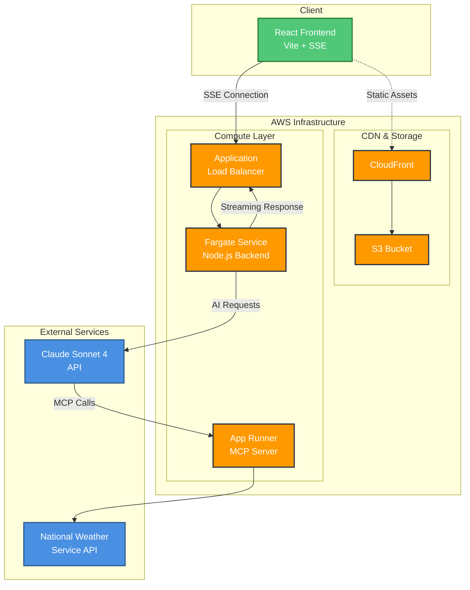

# MCP Chatbot Demo

A demonstration of Model Context Protocol (MCP) architecture showcasing how to build scalable, streaming AI applications with modern cloud infrastructure.

## What is MCP?

Model Context Protocol is Anthropic's open standard that enables AI assistants to securely connect to external data sources and tools. This demo shows how to build a production-ready architecture that leverages MCP servers for enhanced AI capabilities.

## Architecture Overview

This project demonstrates a clean, scalable approach to building AI applications with real-time streaming responses:

- **Frontend**: Vite-based React application with Server-Sent Events (SSE) for real-time streaming
- **Backend**: Node.js service running on AWS Fargate with Application Load Balancer
- **MCP Server**: Fastify-based service on AWS App Runner providing weather data integration
- **Infrastructure**: Single-file AWS CDK for complete infrastructure as code

## Key Architectural Decisions

### Real Streaming with SSE + ALB
Uses Server-Sent Events through Application Load Balancer instead of API Gateway WebSockets to avoid the 29-second integration timeout limitation. This enables true streaming responses for long-running AI operations.

### Container-First Approach
Both backend services run in containers (Fargate and App Runner) providing:
- Scale-to-zero cost optimization
- Consistent deployment environments
- Easy local development with Docker

### Infrastructure as Code
Single CDK file contains all AWS resources, making it easy to:
- Create/destroy complete environments
- Version control infrastructure changes
- Deploy identical environments for dev/test/prod

## Technology Stack

- **Frontend**: Vite, React, TypeScript
- **Backend**: Node.js, Express, Server-Sent Events
- **MCP Server**: Fastify, Node.js
- **Infrastructure**: AWS CDK, Fargate, App Runner, ALB, CloudFront
- **AI Integration**: Claude Sonnet 4 via Anthropic API
- **External APIs**: National Weather Service API

## Getting Started

### Prerequisites
- Node.js 18+
- AWS CLI configured
- Docker (for local development)
- Anthropic API key

### Local Development
```bash
# Install dependencies
npm install

# Start MCP server
cd mcp-server
npm run dev

# Start backend (in separate terminal)
cd backend
npm run dev

# Start frontend (in separate terminal)
cd frontend
npm run dev
```

### Deployment
```bash
# Deploy infrastructure
npm run deploy:infra

# Deploy applications via GitHub Actions
# (Triggered manually via workflow_dispatch)
```

## Environment Management

The project supports multiple environments with manual promotion control:
- **dev**: Automatic deployment on commits to `dev` branch
- **testing**: Manual promotion from dev
- **prod**: Manual promotion from testing

Each environment is completely isolated with its own AWS resources.

## Cost Optimization

- Fargate and App Runner scale to zero when not in use
- CloudFront caches static frontend assets
- MCP server only runs when processing requests
- No always-on resources except S3/CloudFront (minimal cost)

## Architecture Diagram



## License

MIT